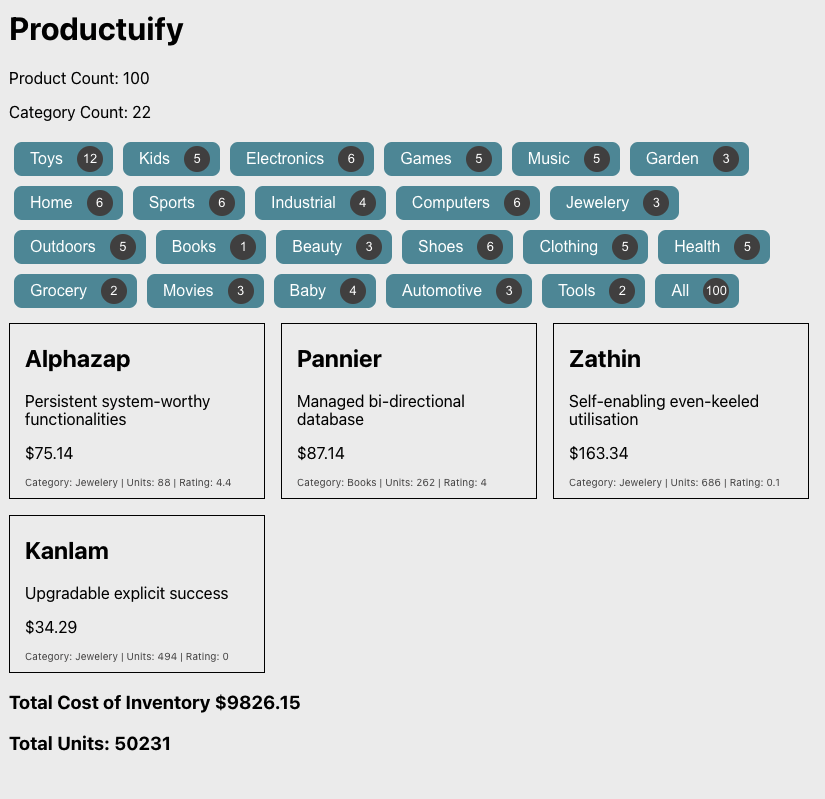

# React Product List

A single page website that allows users to look up product details.

You can find the live site 👉  [here](https://yinnyc.github.io/product-list/)



## Features

- User can click the button to select one or more categories to look up products.

- User can unselect a category by clicking the button again.

- By clicking the 'All' button, user can check the products of all categories.

## Instruction to download the APP

- In your terminal, run the following cammand to clone this repo

  ```terminal command
  git clone https://github.com/yinnyC/product-list.git
  ```

- Run the code below in your terminal to start the app, then you can view the app in the browser: [http://localhost:3000](http://localhost:3000)

  ```terminal command
  yarn start
  ```
